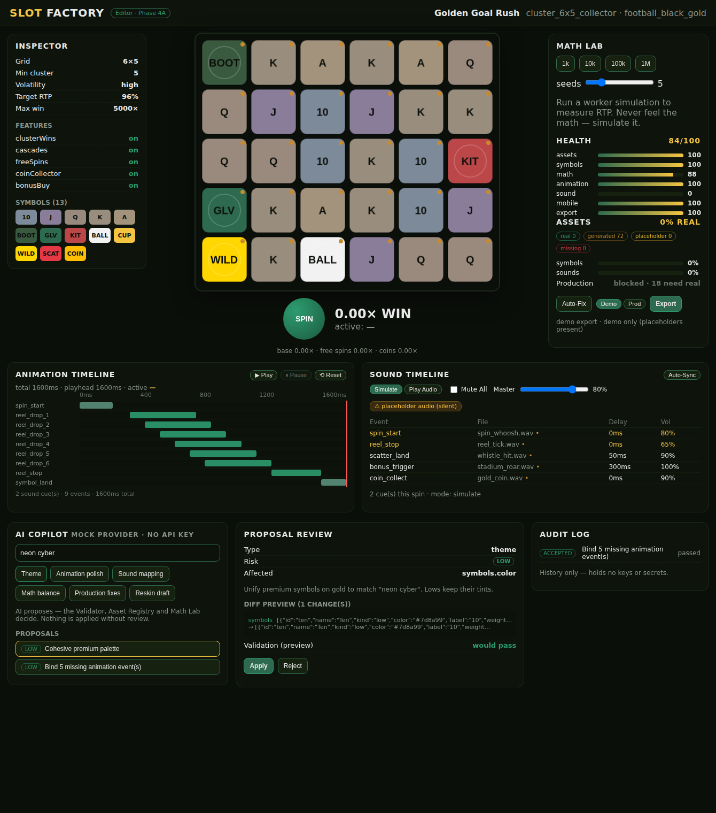
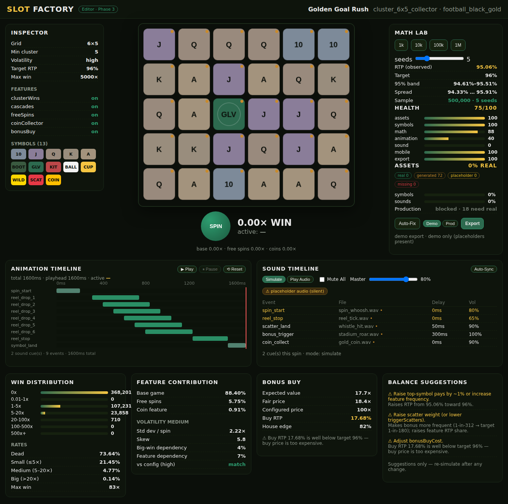
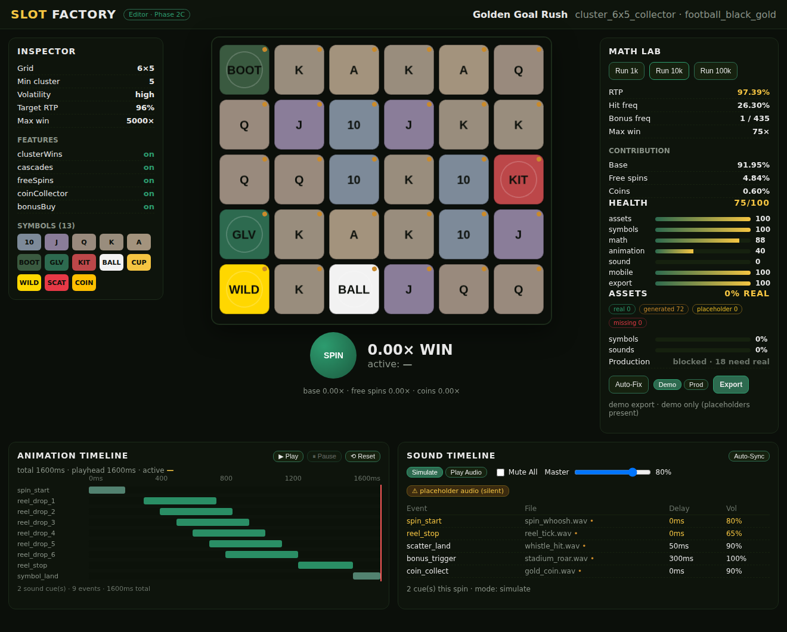
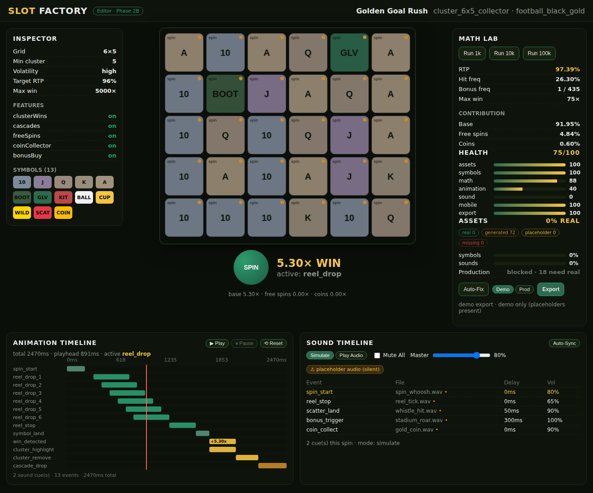
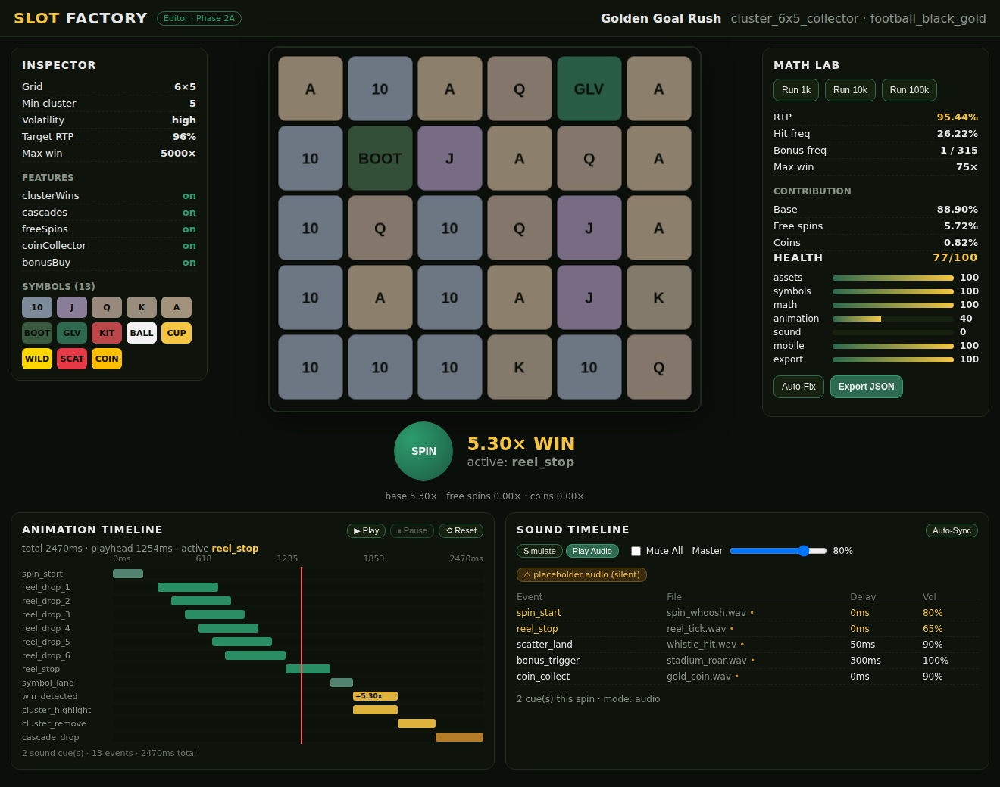

# SLOT FACTORY

> Not "build a slot." **Automate slot production.**
> Idea → playable slot → simulated math → export, in minutes.

SLOT FACTORY is a modular slot **production platform**, not a one-off editor. A slot
is never hidden in code — it is a single, validated **config** that the runtime,
math engine, validator and exporter all read. That separation is what lets one
mechanic become twenty slots (reskin), and what keeps the math honest (you never
*feel* RTP — you simulate it).

The reference project is **Golden Goal Rush**: a 6×5 cluster slot with cascades,
scatter free spins, a coin collector and bonus buy, in a black-&-gold football
stadium skin.

---

## Phase 1 — what's built

This branch delivers the **core production loop** end to end:

| Step | Delivered |
| --- | --- |
| 1. Config schema (source of truth) | `@slotmaker/config` (Zod-validated `SlotProject`) |
| 2. Cluster 6×5 runtime | `@slotmaker/slot-runtime` (seeded RNG, cluster detection w/ wilds, cascades) |
| 3. Renderer + live preview | `apps/editor` (SvelteKit + PixiJS) |
| 4. Golden Goal Rush template/theme/project | `templates/`, `themes/`, `projects/golden-goal-rush.json` |
| 5. Win detection | flood-fill clusters → step sequence (drives preview **and** animation) |
| 6. Math simulation | `@slotmaker/math-engine` (RTP, hit/bonus freq, distribution, contribution) |
| 7. Validator + health score + auto-fix | `@slotmaker/validator` |
| 8. Export (JSON bundle, gated) | `@slotmaker/exporter` |

Everything runs **headless from the CLI** and **live in the browser editor**.

---

## Architecture

Editor and runtime are strictly separated. The config is the only shared state.

```
slotmaker/
  packages/
    config/            # SlotProject schema + validation (the source of truth)
    slot-runtime/      # RNG, grid, cluster detection, cascades, spin orchestration
    math-engine/       # Monte-Carlo sim, multi-seed, volatility, bonus-buy, report (Phase 3)
    animation-system/  # preset registry + buildTimeline() (Phase 2)
    sound-system/      # sound packs, cues, audio runtime, sound resolver (Phase 2)
    asset-pipeline/    # asset resolver, dev pack, registry, manifest, importer (Phase 2B/2C)
    validator/         # checks, health score, safe auto-fix
    exporter/          # validated bundle + asset manifest, demo/production gate
    ai-copilot/        # provider interface, mock provider, proposals, safe apply (Phase 4A)
  apps/
    editor/         # SvelteKit + PixiJS — builder, math lab, validator, export
  templates/cluster-6x5/      # skin-agnostic mechanic descriptor
  themes/golden-goal-rush/    # the football black-&-gold skin
  projects/golden-goal-rush.json   # the reference slot (calibrated to ~96% RTP)
  scripts/          # sim / validate / export CLIs
```

Data flow (one direction): **Config → Runtime → Win detection → Math → Validator → Export.**

---

## Quick start

```bash
pnpm install

pnpm test          # unit tests for runtime, math, validator, exporter
pnpm typecheck     # tsc -b across all packages

pnpm sim           # simulate Golden Goal Rush (100k spins) and print the math report
pnpm validate      # project health score + issue list
pnpm validate --fix   # apply safe auto-fixes and show before/after health
pnpm export        # write a validated bundle to dist/exports/

pnpm editor        # run the live editor (PixiJS preview) at localhost:5173
pnpm editor:build  # production build of the editor
```

`pnpm sim` accepts args: `pnpm sim <projectPath> <spins> <seed>`.

### Example: `pnpm sim`

```
  RTP            95.15%   (target 96%)
  Hit frequency  26.21%   (target 24%)
  Bonus freq     1 in 302 (target 1 in 180)
  Feature contribution:  Base 88.50%  Free spins 5.82%  Coins 0.83%
```

The RTP wobbles ~1% by seed — that's Monte-Carlo variance, and exactly why the
balance assistant flags drift instead of trusting a single run.

---

## Key design decisions

- **Seeded everything.** `Rng` is deterministic; the same seed reproduces the
  same spins and the same simulation, so results are reproducible and debuggable.
- **Cluster pays with wild substitution.** A connected (orthogonal) region of a
  symbol + wilds pays when it is ≥ `minClusterSize` and contains ≥ 1 real symbol.
- **Steps drive both preview and animation.** A spin returns the full cascade
  step list (`grid`, `wins`, `removed`), so the renderer and the (Phase-2)
  animation timeline read the same data.
- **The validator is the export gate.** A project with errors will not export
  unless explicitly forced ("Export anyway"). No broken builds.
- **Auto-fix is safe-only.** It binds default sounds/animations, fills placeholder
  labels and fits the board to mobile — but never touches weights or pays, because
  those change RTP and must go through the simulator.

---

## Phase 4A — AI Slot Copilot Foundation (this branch)

A **controlled** AI assistant: it *proposes*, the user *approves*, and the
**Validator, Asset Registry and Math Lab stay the source of truth**. No silent
mutation, no real assets, no API keys — a deterministic **mock provider** keeps
tests and CI offline.



> AI → Proposal → Diff → User Review → Apply → Validator. Math changes need a
> simulation; asset changes respect the asset registry; export keeps its gate.

- `@slotmaker/ai-copilot`:
  - **Provider interface** (`AIProvider`) with theme / animation / sound / balance /
    reskin generators, plus a deterministic **mock provider** (offline heuristics).
  - **Proposal model** — typed, Zod-validated: id, type, title, summary, risk,
    affected areas, config patch, required validation, provider metadata.
  - **Safe patch system** — `applyProposal()` merges the patch, re-parses against
    the schema, runs the Validator, and **rolls back** on any error. A safety guard
    rejects proposals that try to mark assets `real`, carry secrets/keys, or rewrite
    identity fields.
  - **Audit log** — prompt / proposal / decision / validation outcome; holds no keys.
- **Guardrails enforced in code + tests**:
  - balance proposals **require a math report** (no fabricated RTP);
  - applied asset proposals still resolve as **not real** (no fake reals);
  - the audit log and proposals carry **no secrets/API keys**.
- **Editor** — an AI Copilot panel: prompt, built-in actions (theme / animation /
  sound / math / production fixes / reskin), proposal list, **diff preview**, risk
  badge, **Apply / Reject**, post-apply validation, and the audit log. Applying the
  animation proposal visibly raises Health (animation 40 → 100).

**Next (planned):** 4B AI theme/asset prompt generator · 4C AI balance assistant vs
Math Lab · 4D one-click reskin drafts.

## Phase 3 — Heavy Math Lab

Prove the slot's math fast, with confidence — not a single RTP number you have to
trust. All simulation is seeded and reproducible; the editor runs large sims in a
**Web Worker** so it never freezes.



- **Worker simulation** — `apps/editor/src/lib/sim.worker.ts` runs 1k / 10k / 100k /
  **1M** off the main thread (verified: the UI stays responsive — you can SPIN
  mid-simulation).
- **Multi-seed** — `multiSeedSimulate()` runs N seeds and reports mean / min / max /
  std-dev RTP, a **95% confidence band**, and hit/bonus-frequency ranges.
- **Confidence report** — target vs observed RTP, the band, sample size, seed count,
  and a **low-sample warning** below 100k spins.
- **Win distribution** — buckets `0x / 0.01–1 / 1–5 / 5–20 / 20–100 / 100–500 / 500+`,
  plus dead / small / medium / big win rates and max win.
- **Feature contribution** — base / free spins / coin, in RTP %.
- **Volatility score** — per-spin std-dev + skew + big-win dependency + feature
  dependency → a practical `low/medium/high/extreme` label, compared to config.
- **Bonus Buy calculator** — `analyzeBonusBuy()` simulates the feature in isolation:
  expected value, fair price, configured price, buy RTP, house edge, and warnings
  when a buy is +EV or mispriced.
- **Auto-balance suggestions** — concrete, impact-annotated proposals (weights, pays,
  trigger chance, coin frequency, max-win cap, volatility). Suggestions only — the
  simulator decides.
- **Math report export** — bundles now embed a full `math` report (config, sample,
  RTP confidence, distribution, contribution, volatility, bonus-buy, warnings,
  suggestions); the validator warns when it's missing, low-sample, off-target, etc.

```bash
pnpm sim                       # quick single-seed report
pnpm export projects/golden-goal-rush.json   # multi-seed report embedded in the bundle
```

## Phase 2C — Golden Goal Rush Feel Polish

Make the slot *feel* good — without faking real content. All procedural visuals
and tones still resolve as `generated`; production stays blocked until real assets
exist.



- **Animated renderer** — `SlotBoard` is now a 60fps PixiJS ticker renderer:
  staggered **reel drop** with ease-out, **land squash/bounce**, **win glow + scale
  pulse** on clustered cells, and per-symbol depth (premium symbols get an inner
  ring). Symbols drop in from above the board on every spin and cascade refill.
- **Near-miss + big-win feel** — landing one scatter short of the trigger shows a
  "SO CLOSE" tension cue; wins ≥ 10× run a **count-up** with a big-win celebration.
- **Real asset import pipeline** — `importAssets()` validates format/dimensions/
  path, plans normalization (square canvas + padding), and returns the set of real
  asset paths. Imported reals **override generated** automatically via the resolver
  (no code change needed) — drop in real files later and those slots flip to `real`.
- **Honest throughout** — no real binaries are committed; demo stays fully
  previewable on generated assets, and the production gate still blocks the
  non-real critical assets.

### Using the import pipeline

```ts
import { importAssets, buildAssetRegistry, createGoldenGoalRushDevPack } from "@slotmaker/asset-pipeline";

const result = importAssets(project, [
  { kind: "symbol", symbolId: "football", state: "static", path: "art/football.png", width: 256, height: 256, format: "png" },
  { kind: "sound", event: "bonus_trigger", path: "audio/roar.wav", format: "wav" },
]);
// Feed the real set back into resolution — imported slots now resolve as `real`,
// everything else falls back to the generated dev pack.
const registry = buildAssetRegistry(project, {
  realAssets: result.realAssets,
  devPack: createGoldenGoalRushDevPack(),
});
```

**Deferred to 2D+**: shipping the actual high-quality art/audio binaries and the
final mastered Golden Goal Rush soundtrack — the systems above consume them with
no further code changes.

## Phase 2B — Audio + Symbol-State Asset System

Phase 2B builds the **asset system**, not final content. Every asset slot resolves
to one of four explicit statuses — `real`, `generated`, `placeholder`, `missing` —
so a project is always honest about what still needs real art/audio. No fake
binaries are committed.



- `@slotmaker/asset-pipeline` — the **resolver** (requested state → real → static
  fallback → generated → missing), a procedural **Golden Goal Rush dev pack**
  (`gen:` descriptors, never real files), an **asset registry** with completeness
  metrics, and a serializable **manifest**. `assessProduction()` re-resolves
  strictly (real assets only) to list what blocks a production build.
- `@slotmaker/sound-system` — `resolveSoundCue()` (real file → generated tone →
  placeholder → missing) and a guarded **WebAudio tone sink** so generated cues are
  audible in demo without any files.
- **Exporter** — `demo` vs `production` profiles. Demo allows generated/placeholder
  assets (manifest records exactly what); **production blocks** any non-real
  critical asset (unless forced). Bundles now carry the asset manifest + status.
- **Validator** — distinguishes generated-used (info) / placeholder-used / missing
  critical / production-blocked, under the `assets` health category.
- **Editor** — board renders the resolved render state per tile with a status dot;
  demo audio plays synthesized tones; an **Assets** panel shows real/generated/
  placeholder/missing badges, symbol/sound completeness, and **production readiness**
  with a demo/production export toggle.

**Deferred to 2C** (per scope): real sound assets + final audio playback, the
symbol-state asset import/normalize pipeline, and Golden Goal Rush art polish.

## Phase 2A — Animation Timeline + Sound Cue Foundation

Event-based **animation** and **sound** systems, both fed by the exact same spin
step sequence as the live preview — so visuals, timeline and audio can never drift.



- `@slotmaker/animation-system` — `buildTimeline(project, round)` turns a played
  round into ordered, timed events (`spin_start`, staggered `reel_drop` per
  column, `symbol_land`, `win_detected` / `cluster_remove` / `cascade_drop` per
  cascade, `scatter_land`, `bonus_trigger`, `coin_collect`, `big_win_start`),
  plus a swappable preset registry and `eventToSymbolState()`.
- `@slotmaker/sound-system` — `buildSoundCues(project, timeline)` schedules sounds
  against the timeline (event start + binding delay); `autoSyncSounds()` fills
  unbound events from a pack; **`createSoundPlayer()`** is a placeholder-safe audio
  runtime (`playCue`, `stopCategory`, `setMasterVolume`, `muteCategory`) that never
  crashes on missing/placeholder files — it records a warning instead.
- **Symbol states** — the config now models per-symbol render states
  (`static / spin / land / win / disabled`); runtime, editor and validator all
  understand them.
- **Validator hardening** — distinguishes missing sound binding vs placeholder file
  vs empty path vs out-of-range volume vs negative delay vs unmapped critical
  event; adds a **symbols** health category for state coverage; checks animation
  durations/delays.
- **Editor** — board plays back off one timeline clock with **Play / Pause / Reset**
  and a live "active event" readout; **Animation Timeline** (lanes + playhead) and
  **Sound Timeline** (Simulate / Play-Audio toggle, Mute All, master volume,
  placeholder badge) panels.
- **CI** — GitHub Actions runs typecheck, tests, editor build, and validate/export
  smokes against Golden Goal Rush on every PR to `main`.

**Not yet in Phase 2A** (deferred): full real-audio playback with real files, the
final symbol-state asset pipeline, and real sound-asset import.

## Roadmap (next phases)

- **Phase 2B** — asset pipeline + real audio/asset import, symbol-state asset
  wiring, responsive HUD editor, move simulation into a Web Worker.
- **Phase 3** — 1M/10M parallel simulation, volatility graphs, bonus-buy & ante
  calculators, auto-balance that edits weights and re-simulates.
- **Phase 4** — AI agents (theme/asset/animation/sound/QA), one-click reskin,
  preset marketplace.
- **Phase 5** — Factory mode: batch-generate, simulate and export many slots from
  one mechanic.
